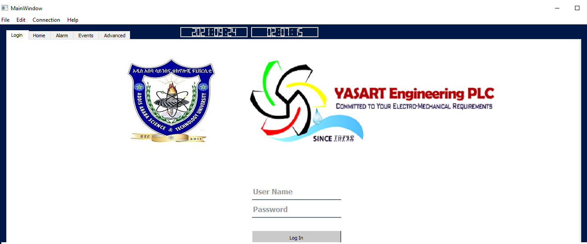
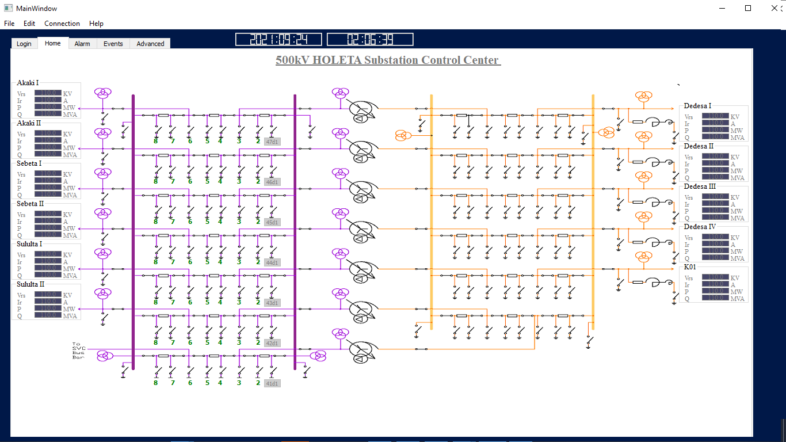

# Scada-Implementation-for-Holeta-Substation
The Liberaries used in this code are
- Pymodbus
- Sqlite3
- PyQt5
After running the code, a new window will open:

There are three different types of opeartors for this user interface, named: Operator, Manager, Superuser.

**Operator**:   Has very limited accessablity to the tabs. Username & Password [Username: operator, Password: operator123]

**Manager**:    Moderate access to tabs. Username & Password [Username: manager, Password: manager123]

**Superuser**:  All tabs are accessable. Username & Password [Username: super, Password: super123]

